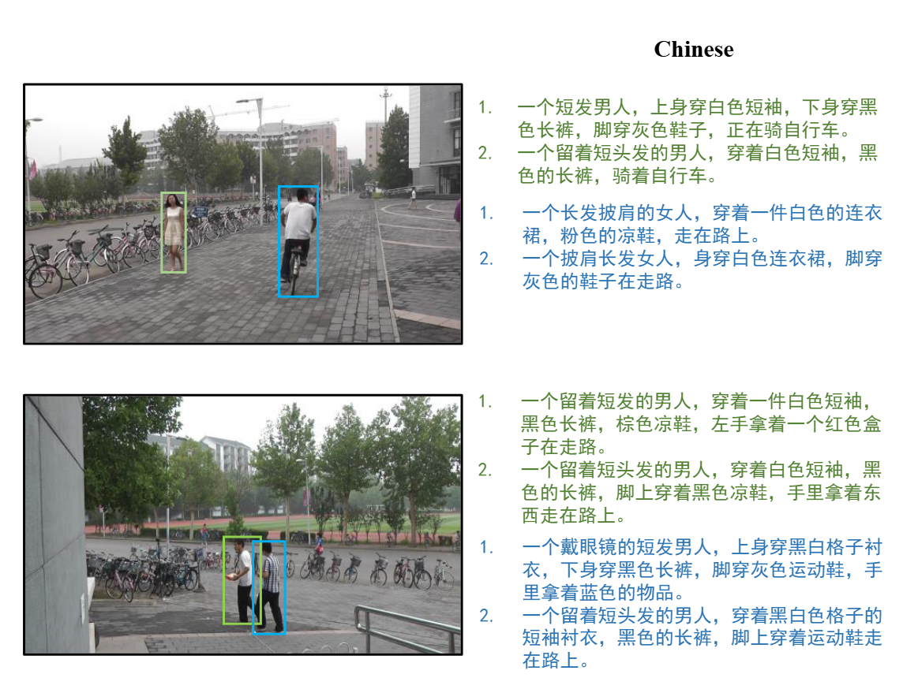

# PRW-TBPS-CN dataset

## Folder Structure
```
- frame
    - c1s1_000151.jpg
    - c1s1_000376.jpg
    - ...
- nlpPS_descritpions.json
```
frame: contains 11816 frames of the PRW dataset.
nlpPS_descritpions.json: Contains the descriptions, bounding box and id of the person in each frame.

Examples of the dataset:
